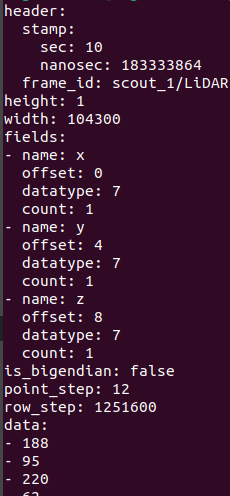
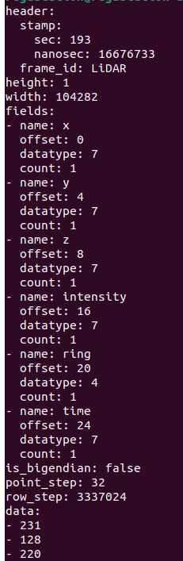

# ISAAC Sim PCD Converter ROS 2 Package

## Overview
This ROS 2 package processes LiDAR point cloud data to include additional fields such as **ring**, **intensity** and **time**, for ISAAC SIM. It dynamically subscribes to a specified topic for input data, computes the ring ID, intensity and time offset for each point, and republishes the augmented point cloud to an output topic.

The package supports dynamic configuration of parameters like the number of vertical beams (**N_SCAN**) and horizontal resolution (**Horizon_SCAN**) through launch file arguments.

---

## Installation

```bash
sudo xargs -a requirements.txt apt install -y
```

## Running the Node
To launch the node with dynamic parameters:
```bash
ros2 launch isaac_sim_pointcloud_full_publisher full_pcd_pub.launch.py robot_namespace:=scout_1 N_SCAN:=128 Horizon_SCAN:=2048
```

---

## Output

<p align="center">
  
  
</p>


## Dependencies
- ROS 2 (Humble or later)
- rclcpp
- sensor_msgs
- std_msgs
- PCL (Point Cloud Library)
- pcl_conversions

---

## Topics
| Topic Name                                      | Type                                         | Role       |
|-------------------------------------------------|---------------------------------------------|------------|
| `/robot_namespace/scan3D`                       | `sensor_msgs/msg/PointCloud2`               | Subscriber |
| `/robot_namespace/scan3D_with_rings`            | `sensor_msgs/msg/PointCloud2`               | Publisher  |

Note: Replace `robot_namespace` with the desired namespace using the launch file argument.

---

## Parameters
| Parameter Name      | Default Value | Description                                                     |
|---------------------|---------------|-----------------------------------------------------------------|
| `robot_namespace`   | `robot_x`     | Namespace of the robot used in the topic names.                 |
| `N_SCAN`            | `128`         | Number of vertical beams (LiDAR channels).                      |
| `Horizon_SCAN`      | `2048`        | Horizontal resolution (points per scan).                        |

---

## Supported LiDAR Configuration
This package is tested with the following LiDAR configuration:
- **Beams**: 128
- **Points per Scan**: 2048
- **Frame ID**: "LiDAR"
- **Ring Field**: Calculated dynamically based on vertical angle.

---

## Building the Package
```bash
colcon build --packages-select isaac_sim_pointcloud_full_publisher
```

---

## Example Visualization
To visualize the output point cloud with the `ring` field:
```bash
rviz2
```
- Add a **PointCloud2** display.
- Set the topic to `/robot_namespace/scan3D_with_rings`.
- Use **Color Transformer** -> **AxisColor** to view different ring IDs.

---

## License
This package is released under the Apache 2.0 License.
